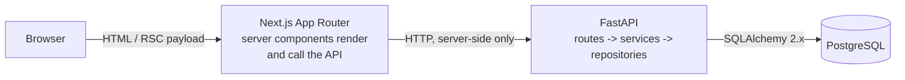

# DevPilot

DevPilot is a workspace for working on a codebase with an assistant that has actually read it. A
developer connects a GitHub repository; DevPilot indexes it, answers questions with the relevant
files in hand, proposes code changes as a reviewable diff, and — only after a human approves — opens
a pull request. The product's centre of gravity is the review step: nothing reaches a repository
without someone deciding that it should.

## What it does

The intended end-to-end flow is:

1. **Connect** a GitHub repository to a workspace.
2. **Index** it — walk the default branch, parse source files, and prepare them for retrieval.
3. **Ask** questions and get answers grounded in specific files and line ranges, with the retrieved
   sources shown alongside the answer.
4. **Review** proposed edits as a diff, file by file.
5. **Ship** approved changes as a commit on a new branch and a pull request.

## Current status

**This milestone is the production-grade foundation and UI shell.** It is honest about what exists:

- The Next.js application, its design system, and every screen listed below are built and wired to
  the real API.
- The FastAPI service, its error contract, configuration, database schema and migration are built.
- **No GitHub integration, no indexing, no retrieval, and no answer generation exist yet.** Screens
  that depend on them render explicit, explained empty states — driven by real backend state, not by
  hardcoded flags. Nothing simulates an answer, a repository, a diff, or a pull request.

Concretely: the API reports whether GitHub and an AI provider are configured in *this deployment's*
environment, and the UI renders what it is told. Connecting a repository is unavailable because the
OAuth flow does not exist. The "Index repository" button is inert and says so.

## Architecture



The browser never calls the API directly. Server components fetch through `src/lib/api.ts`, which
returns a discriminated `ApiResult` instead of throwing — so every page is forced to handle the
failure case, and the backend origin stays out of the client bundle.

Inside the backend a request flows in one direction only:

```
route (HTTP shape) -> service (rules) -> repository (SQL) -> session (transaction)
```

Routes never contain SQL. Data access lives in `app/repositories/` so the statements stay visible in
one place.

## Repository structure

```
DevPilot/
├── backend/
│   ├── app/
│   │   ├── main.py            application factory, middleware, lifespan
│   │   ├── api/               routers, route modules, shared dependencies
│   │   ├── core/              configuration, logging, error taxonomy
│   │   ├── db/                declarative base, engine, session lifecycle
│   │   ├── models/            SQLAlchemy models
│   │   ├── repositories/      data access — all SQL lives here
│   │   ├── schemas/           Pydantic request/response models
│   │   └── services/          rules that combine config and data access
│   ├── alembic/               migration environment and versions
│   └── tests/                 pytest suite
├── frontend/
│   └── src/
│       ├── app/               routes, layouts, error and loading boundaries
│       ├── components/        UI primitives, layout shell, feature components
│       └── lib/               API client, navigation model, theme store
├── docker-compose.yml         PostgreSQL for local development
└── .env.example
```

### Routes

| Frontend                                                  | Purpose                              |
| --------------------------------------------------------- | ------------------------------------ |
| `/`                                                        | Dashboard                            |
| `/repositories`, `/repositories/connect`                   | Repository list and connection state |
| `/repositories/[owner]/[repo]`                             | Workspace overview                   |
| `.../code`, `.../ask`, `.../changes`, `.../pull-requests`  | Workspace tabs                       |
| `/activity`, `/settings`                                   | Activity log and settings            |

| API                                        | Purpose                                      |
| ------------------------------------------- | -------------------------------------------- |
| `GET /health`                               | Liveness — touches no dependency             |
| `GET /health/ready`                         | Readiness — verifies the database answers    |
| `GET /api/v1/meta/integrations`             | Which integrations are configured (booleans) |
| `GET /api/v1/repositories`                  | Connected repositories                       |
| `GET /api/v1/repositories/{owner}/{name}`   | One repository, or a structured 404          |

Every failure — from any route — has the same body:

```json
{ "error": { "code": "not_found", "message": "…", "details": { } } }
```

so the frontend branches on `code` rather than parsing prose. Unexpected exceptions are logged with
a traceback and reported generically; driver messages, which can embed the connection string, never
reach the client.

## Local development

Prerequisites: Node 20+, Python 3.11+, and Docker (or a local PostgreSQL 16).

```bash
cp .env.example .env
```

**1. Database**

```bash
docker compose up -d --wait
```

Without Docker, create a PostgreSQL 16 database and point `DATABASE_URL` at it.

**2. Backend**

```bash
cd backend
python -m venv .venv
# Windows:      .venv\Scripts\activate
# macOS/Linux:  source .venv/bin/activate
pip install -e ".[dev]"
alembic upgrade head
uvicorn app.main:app --reload --port 8000
```

API docs at http://localhost:8000/docs (local environments only).

**3. Frontend**

```bash
cd frontend
npm install
npm run dev
```

http://localhost:3000

**Checks**

```bash
# backend
cd backend && pytest && ruff check . && ruff format --check . && mypy app

# frontend
cd frontend && npm test && npm run lint && npm run typecheck && npm run build
```

## Environment variables

All configuration comes from the environment; `.env.example` documents every variable. Secrets are
read by the backend only — never sent to the browser, never logged. The API exposes *whether* an
integration is configured, never the credential.

| Variable                                            | Used by  | Notes                                                   |
| ---------------------------------------------------- | -------- | ------------------------------------------------------- |
| `DATABASE_URL`                                       | backend  | Keep the `+psycopg` suffix; psycopg 3 is the driver.    |
| `POSTGRES_USER` / `_PASSWORD` / `_DB` / `_PORT`      | compose  | Must match `DATABASE_URL`.                              |
| `DEVPILOT_ENV`                                       | backend  | `local` enables `/docs`; use `production` when deployed.|
| `LOG_LEVEL`, `CORS_ORIGINS`                          | backend  | `CORS_ORIGINS` is comma-separated.                      |
| `BACKEND_URL`                                        | frontend | Server-side only; the browser never sees it.            |
| `NEXT_PUBLIC_APP_URL`                                | frontend | Public origin, for absolute links and future callbacks. |
| `GITHUB_CLIENT_ID` / `_SECRET` / `_WEBHOOK_SECRET`   | backend  | Unset today; only their presence is reported to the UI. |
| `ANTHROPIC_API_KEY`                                  | backend  | Reserved for the retrieval and answering milestone.     |

## Database schema

`users`, `repositories`, `conversations`, `messages`. Five decisions worth stating:

- **UUID primary keys, generated in the application.** A caller holds the id before the INSERT,
  which makes logging and building related rows in one flush straightforward.
- **`repositories` is unique on `(provider, owner, name)`.** That triple is also how the frontend
  addresses a repository (`/repositories/{owner}/{repo}`), so the URL and the constraint agree.
  Lookups are case-insensitive, because a pasted URL may not match the stored casing.
- **`indexing_status` is an enum with values that cannot occur yet** (`queued`, `indexing`,
  `indexed`, `failed`). The column's meaning is part of the schema contract ingestion will fill in;
  only `not_indexed` occurs today.
- **No `repository_memberships` table.** A single `connected_by_user_id` covers the current
  single-workspace model. Membership arrives with multi-user workspaces and is cheap to migrate to;
  adding it now would be a table with no reader.
- **Indexes follow actual reads.** `(repository_id, created_at)` on conversations and
  `(conversation_id, created_at)` on messages exist because both listings are always "rows for one
  parent, in time order". Nothing else is indexed speculatively.

Foreign keys cascade where the child is meaningless without its parent (messages → conversations,
conversations → repositories) and `SET NULL` where it is not — deleting a user should not delete the
repository they connected.

## Engineering decisions

**Next.js (App Router).** The screens are read-heavy and mostly rendered from API data. Server
components put the API call, the empty-state decision and the markup in one file with no client-side
data-fetching layer, and keep `BACKEND_URL` off the client entirely.

**FastAPI + Pydantic + SQLAlchemy 2.x.** The work ahead — parsing repositories, embedding code,
calling model APIs — is Python work. Pydantic gives one schema definition that is also the OpenAPI
contract. SQLAlchemy 2.x's `select()` keeps queries readable as SQL instead of hiding them; sessions
are synchronous and routes are declared `def`, so they run in FastAPI's threadpool and the query path
stays easy to reason about. Async is a change to make when a measurement asks for it.

**PostgreSQL.** Relational data with real foreign keys, plus `pgvector` when embeddings arrive —
which means retrieval will not require a second datastore.

**Docker Compose for the database only.** Stateful infrastructure is worth containerising; the app
processes are not, because `uvicorn --reload` and `next dev` are faster on the host.

**Deliberately absent:** Redis, a queue, a vector database, containers for the app processes, and
authentication scaffolding. Each solves a problem this codebase does not have yet.

## Design notes

Dark-first, with a working light theme. Tokens are defined twice over: a raw `--dp-*` palette that is
the only thing a theme changes, mapped onto Tailwind utilities in `@theme`, so switching themes never
requires touching a component. The type scale is one step denser than Tailwind's default (13px base)
because this is a tool, not a marketing page. Depth comes from hairline borders rather than shadow,
and colour is reserved for the accent, status, and nothing else.

Empty states are a first-class component, not an afterthought — they are the default state of most
screens in this milestone, so each one names what will fill the space and why it is empty.

## Roadmap

1. **GitHub integration** — OAuth, token storage, repository connection.
2. **Repository ingestion** — fetch the default branch, walk files, track sync state.
3. **Code parsing** — language-aware splitting into functions, classes and modules.
4. **Embeddings** — embed the parsed units and persist vectors (`pgvector`).
5. **Vector retrieval** — find the code that answers a question.
6. **RAG** — grounded answers with citations rendered in the context panel.
7. **Code-change generation** — turn an accepted answer into a concrete edit.
8. **Diff review** — file-by-file approval before anything is applied.
9. **GitHub PR creation** — commit approved changes to a branch and open a pull request.
