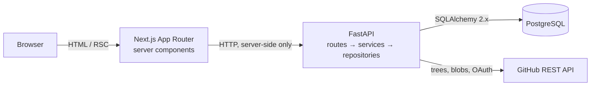
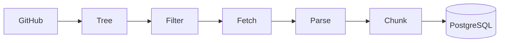
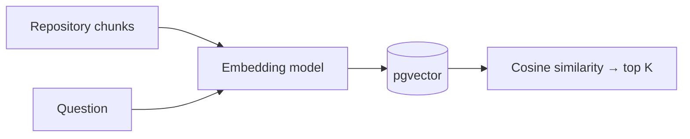
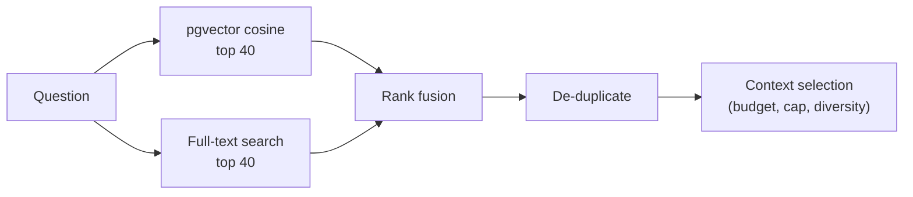
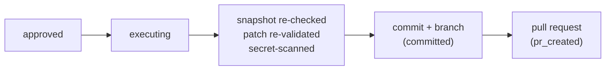

# DevPilot

**An AI engineering workspace that actually reads your codebase.**

Connect a GitHub repository and DevPilot builds a structured, syntax-aware index of it — every
function, class and method, with its file, symbol and line range intact. From that index it
answers questions with citations, investigates a change request with bounded read-only tools, and
proposes a patch as a unified diff.

**You review that diff, and nothing reaches GitHub until you approve it.** Once you do, DevPilot
opens a real pull request: branch, commit, PR, through GitHub's Git Data API.

```
Understand → Investigate → Change → Review → Ship
```

<br>

## What it does

Connect a repository, and DevPilot:

- **Signs you in with GitHub** — OAuth, with access tokens encrypted at rest and never exposed to
  the browser.
- **Discovers the full file tree** via the Git Trees API, including repositories large enough that
  GitHub truncates the recursive listing.
- **Filters intelligently** — vendored directories, build output, binaries and oversized files are
  skipped by a single policy component, not by checks scattered through the pipeline.
- **Parses with Tree-sitter** — real grammars, not regular expressions.
- **Chunks by structure** — a function becomes a chunk, a method remembers the class that contains
  it, and a file with no parseable structure falls back to conservative line windows.
- **Stores everything in PostgreSQL** with the repository state machine, so an index either
  succeeds completely or leaves the previous good index untouched.

<br>

## The guided experience

DevPilot walks you through a repository as a journey, and always makes the next action obvious:

```
Connect → Index → Understand → Investigate → Review → Ship
```

- **Home** continues where you left off: the most recently active repository shows its progress
  and one primary next step; the others show how far each has come.
- **Understand** opens as a guided exploration — starting-point questions grouped by intent, with
  your own question as the alternative — and becomes a compact, structured report once you ask:
  answer, evidence, what it means, and **Investigate this code →**.
- **Citations are navigation.** Each one opens the exact file and lines it came from; retrieval
  scores stay behind a diagnostics toggle.
- **The sidebar is a path**, not a list of routes: completed steps are checked, the next step is
  marked, future steps are subdued — and nothing is blocked.
- **Progress is never invented.** Every state comes from real records, and long-running steps show
  what they do rather than fake percentages.

Design, derivation rules and the reusable patterns are documented in
[docs/guided-experience.md](docs/guided-experience.md).

<br>

## Architecture



The browser never calls the API directly. Server components fetch through a typed client that
returns a discriminated result rather than throwing, so every screen handles its failure case
explicitly. The backend origin and every credential stay server-side.

Inside the backend, a request flows one direction only:

```
route (HTTP shape) → service (rules) → repository (SQL) → session (transaction)
```

Routes never contain SQL.

<br>

## The indexing pipeline



| Stage | What happens |
| --- | --- |
| **Tree** | Recursive Git Trees call. If GitHub reports `truncated`, subtrees are walked individually and paths rebuilt — an incomplete listing is never treated as complete. |
| **Filter** | One policy decides what is indexable, and records a reason for everything skipped. |
| **Fetch** | Blobs downloaded through a bounded thread pool (8 concurrent by default), streamed rather than accumulated. |
| **Parse** | Tree-sitter builds a syntax tree. A parse failure marks that one file unparsed and the run continues. |
| **Chunk** | Structural units become chunks; oversized symbols split while keeping parent context and line ranges. |
| **Persist** | The new snapshot replaces the old one inside a transaction, then the repository is marked indexed. |

### Language support

**Parsed into symbols** — Python, JavaScript, TypeScript, JSX, TSX.

**Stored and searchable as text** — C, C++, C#, CSS, Go, HTML, Java, JSON, Markdown, PHP, Ruby,
Rust, Shell, SQL, TOML, YAML, plain text.

A language is only listed as parsed when a Tree-sitter grammar is actually configured for it.
Everything else is indexed as text rather than being quietly dropped.

### Chunking

Chunks follow syntax, not character counts:

```
class UserService
├── __init__          → chunk (parent_symbol: UserService)
├── create_user       → chunk (parent_symbol: UserService)
└── reset_password    → chunk (parent_symbol: UserService)
```

Each chunk records its type, symbol, parent symbol, line range, byte range and language — enough to
render `path → symbol → lines → source` without reparsing anything. Context is stored as metadata
rather than by copying the enclosing class into every method.

A symbol larger than the chunk limit is split into parts that record `part_index` / `part_count`,
so nothing is silently truncated. A file with no recognisable structure falls back to line windows.

**Trivia is attached, not stored alone.** A divider such as `# --- PAGE 2: COMMERCIAL ---` or the
`;` closing `const Page = () => {...};` carries no code. Stored as its own chunk, its embedding is
mostly the path header, which sits close to *every* question and outranks real code. So a comment
block directly above a declaration becomes part of that declaration, and closing punctuation joins
the declaration it closes. Only trivia moves: module code (imports, constants, setup) stays its own
chunk, two declarations are never merged, the size limit still applies, and byte ranges stay
contiguous — nothing is duplicated or dropped.

### Resource limits

| Limit | Default | Override |
| --- | --- | --- |
| Max file size | 512 KB | `INDEX_MAX_FILE_BYTES` |
| Max indexed bytes per repository | 50 MB | `INDEX_MAX_TOTAL_BYTES` |
| Max files per repository | 5,000 | `INDEX_MAX_FILES` |
| Max chunk size | 8,000 chars | `INDEX_MAX_CHUNK_CHARS` |
| Fallback chunk window | 120 lines | `INDEX_FALLBACK_CHUNK_LINES` |
| Concurrent blob downloads | 8 | `GITHUB_MAX_CONCURRENCY` |

Repository content is treated as untrusted data throughout. DevPilot reads files — it never
executes repository code, installs dependencies, or runs build commands.

<br>

## Indexing states

```
not_indexed ──▶ indexing ──▶ indexed
                    │
                    └──────▶ failed
```

`failed` means *the most recent attempt* failed. A previous successful index survives it, so a
transient GitHub outage never costs you a working index.

<br>

## Quick start

**Requirements:** Node 20+, Python 3.11+, PostgreSQL 16 with the
[pgvector](https://github.com/pgvector/pgvector) extension.

```
git clone https://github.com/NatureHawk/Devpilot.git
cd Devpilot
cp .env.example .env
```

### 1. Database

```
docker compose up -d --wait
```

Or point `DATABASE_URL` at any PostgreSQL 16 instance.

### 2. Backend

```
cd backend
python -m venv .venv
```

Activate it — `.venv\Scripts\Activate.ps1` (PowerShell), `.venv\Scripts\activate.bat` (cmd), or
`source .venv/bin/activate` (macOS/Linux) — then:

```
pip install -e ".[dev]"
alembic upgrade head
uvicorn app.main:app --reload --port 8000
```

Run from `backend/`, so `app` is importable. API docs at `localhost:8000/docs`.

### 3. Frontend

```
cd frontend
npm install
npm run dev
```

Open **http://localhost:3000**.

### 4. Connect GitHub

Register an OAuth app at **github.com/settings/developers**:

| Field | Value |
| --- | --- |
| Homepage URL | `http://localhost:3000` |
| Authorization callback URL | `http://localhost:3000/api/auth/github/callback` |

Put the Client ID and secret in `.env`, generate a `SECRET_KEY`
(`python -c "import secrets; print(secrets.token_urlsafe(48))"`), restart the backend, then sign in
from Settings.

<br>

## Configuration

Every value comes from the environment; `.env.example` documents each one. Secrets are read by the
backend alone — never sent to the browser, never logged. The API reports *whether* an integration is
configured, never the credential itself.

| Variable | Purpose |
| --- | --- |
| `DATABASE_URL` | PostgreSQL connection. Keep the `+psycopg` prefix. |
| `SECRET_KEY` | Signs sessions and OAuth state; derives the token encryption key. |
| `GITHUB_CLIENT_ID` / `GITHUB_CLIENT_SECRET` | OAuth app credentials. |
| `BACKEND_URL` | Where Next.js reaches the API, server-side only. |
| `NEXT_PUBLIC_APP_URL` | Public origin, used for OAuth redirects. |
| `LLM_PROVIDER` | `groq`, `gemini`, `openrouter`, or `anthropic`. See [Language model](#language-model). |
| `GROQ_API_KEY` / `GROQ_MODEL` | Groq credential and model (`openai/gpt-oss-120b`). Free tier; limits are set by Groq and reported in `x-ratelimit-*` headers, not guaranteed here. |
| `GEMINI_LLM_API_KEY` / `GEMINI_LLM_MODEL` | Gemini generation credential and model. The key falls back to `GEMINI_API_KEY`; model defaults to `gemini-3.6-flash`. Without a key for the selected provider, Ask and Changes report a configuration state rather than failing obscurely. |
| `ANTHROPIC_API_KEY` / `LLM_MODEL` / `LLM_EFFORT` | Anthropic credential, model and thinking depth (`claude-opus-5` at `high`). `LLM_EFFORT` also drives OpenRouter reasoning and maps (conservatively) to Groq `reasoning_effort`. |
| `AGENT_MAX_TOOL_CALLS` | Investigation tool budget. Defaults to 8. |
| `VOYAGE_API_KEY` / `GEMINI_API_KEY` / `EMBEDDING_PROVIDER` | Embedding provider credentials and selector (`gemini` or `voyage`). Without a key, indexing and search report a configuration error rather than failing obscurely. |
| `EMBEDDING_MODEL` / `EMBEDDING_DIMENSIONS` | Model identity and vector width. Changing either requires a re-index. |
| `INDEX_*` / `GITHUB_*` / `SEARCH_*` | Indexing limits, GitHub client tuning, retrieval bounds. |
| `RETRIEVAL_SEMANTIC_CANDIDATES` / `RETRIEVAL_LEXICAL_CANDIDATES` | Candidate pool sizes before fusion (40 / 40). |
| `CONTEXT_MAX_CHARS` / `CONTEXT_MAX_SOURCES` | Retrieved-source budget per answer. Unset chars uses the provider default (Groq 12,000; OpenRouter 24,000; Gemini/Anthropic 40,000); sources default to 12. |

<br>

## Semantic retrieval

Indexing does not stop at chunks. Every chunk is turned into an **embedding** — a vector of numbers
positioning it in a space where related meaning sits close together. That is what lets "where is
authentication handled" find `verify_session()` even though the two share no words.



**Provider.** Voyage AI `voyage-code-3` at 1024 dimensions, behind a small `EmbeddingProvider`
interface — the application never imports a provider SDK, so a local model can replace it later by
implementing one protocol.

**What gets embedded.** Not raw source. Each chunk is rendered as a deterministic representation
carrying its repository, path, language, kind and qualified symbol above the code, so the model sees
the vocabulary a question is likely to use. No LLM summarises anything: the representation is a pure
function of stored fields, so re-embedding unchanged code produces identical vectors.

**Queries and documents are embedded differently.** Retrieval models are asymmetric — a question and
a piece of source are not the same kind of text — so the input kind is a required argument rather
than a default that could silently degrade ranking.

**Storage.** A `chunk_embeddings` table rather than a column on `code_chunks`: a chunk is meaningful
before a vector exists, vector width belongs to the model rather than the chunk, and re-embedding
under a new model becomes a delete-and-insert on one table. Each row records its model and
dimensions, and search filters on the model the repository was actually indexed with — vectors from
different models are not comparable, and this makes mixing them impossible rather than merely
unlikely.

**Similarity.** Cosine, via pgvector's `<=>` operator, with an HNSW index built on
`vector_cosine_ops`. Cosine compares orientation rather than magnitude, which suits text embeddings
where vector length reflects little of interest. Scores are reported as `1 - distance`, so higher is
nearer.

> A score is a **ranking signal, not a probability**. It is meaningful for ordering results against
> each other, not as an absolute relevance threshold — there is no calibrated cutoff above which a
> result is "correct".

**Candidate pool.** 40 nearest chunks by default (`RETRIEVAL_SEMANTIC_CANDIDATES`). Ordering and
limiting happen in the database on the indexed distance expression, so only the returned rows ever
materialise their source content.

**Indexing is atomic across embeddings.** A repository reaches `indexed` only after its vectors are
stored, so that state means *searchable*, not merely *parsed*. If the provider fails, the attempt is
marked `failed` and the previous index is left intact. Re-indexing replaces vectors wholesale, so old
and new embeddings never mix.

### Hybrid retrieval

Meaning is not enough on its own. "Where is `useMemo` used?" or "what does `get_db` do?" name a token
that either appears in the code or does not — a lexical question. So every query runs two retrievals
over the same chunks, in the same PostgreSQL:



**Lexical search** is PostgreSQL full-text search over a generated `tsvector` with a GIN index — no
separate search engine. Terms are normalised in the application, because PostgreSQL's parser is
built for prose: it splits `get_db` but keeps `useMemo` whole and treats `/analytics/operations` as a
single token. DevPilot stores the joined identifier and its parts (`get_db` → `getdb get db`), with
path and symbol names weighted above body text. Question terms are weighted by inverse document
frequency, and terms present in more than half the repository's chunks are left out of the query.

**Fusion** is Reciprocal Rank Fusion over four ranked lists — semantic, lexical, *named* (the
question names the chunk's symbol or file) and *mentioned* (an identifier from the question appears
verbatim). RRF combines ranks, never raw scores: cosine similarity and text rank live on unrelated,
uncalibrated scales, and one embedding model's cosine range is not another's. A chunk near the top of
several lists beats one at the top of a single list; a definition of `get_db` both names and mentions
it, so it outranks its callers. The fused value orders candidates and is not a probability. The
original cosine score is kept on every candidate.

**Context selection** takes candidates best-first until `CONTEXT_MAX_CHARS` or
`CONTEXT_MAX_SOURCES` is reached. Only supported candidates are eligible — an exact match, a strong
lexical match (at least half the question's term weight), or a chunk whose semantic score is clearly
above chance for its rank (below) — so the repository is never sent just because it fits, and a chunk
sharing one incidental word with the question is not evidence. After three chunks from one file,
that file's remaining chunks wait behind other files' evidence. A chunk that does not fit is skipped
for a smaller one rather than cut. When nothing is evidence, only the three nearest chunks by meaning
are sent, so the model can say what the repository does contain. The budget is characters, which only
approximate tokens (code averages roughly 3–4 characters per token); the default follows the selected
provider — 12,000 for Groq, whose free tier allows 8K tokens per minute for the whole request.

**Evidence strength** (`none` / `weak` / `useful`) is classified from signals that do not depend on
an embedding model's score scale: whether the question names an existing symbol, file or identifier;
whether a strong lexical match is also in the semantic top 10 (two independent methods agreeing); and
the best semantic match's **excess over chance**. Even unrelated chunks produce a "best" score about
two standard deviations above the pool mean when there are 40 of them, so a raw separation cut-off
would mistake that for evidence. Instead each candidate's score, in standard deviations of this
query's own pool, is compared with where the k-th best of n unrelated scores would be expected to
fall (Blom's normal order-statistic approximation). Half a standard deviation above chance is
evidence; a quarter is thin evidence. On the RetailHub evaluation set every supported question
cleared +0.6 and every unsupported one stayed at or below +0.05. Comment-only chunks never count as
evidence, and no confidence percentage is ever produced.

### Retrieval inspector

The repository workspace includes a retrieval inspector. For a query it shows the sources an answer
would actually receive — file, symbol, line range, semantic score, keyword rank and exact-match kind,
each expandable to source — with the budget used and the evidence strength, plus the semantic and
keyword candidate lists they were fused from, collapsed. It answers "did retrieval choose the right
code?" before any model writes prose over it. No language model is invoked.

<br>

## Language model

Answer generation and change investigation go through one `LLMProvider`
interface. Four implementations sit behind it, chosen by `LLM_PROVIDER`;
nothing above the provider layer knows or cares which is active.

| `LLM_PROVIDER` | Model | Notes |
| --- | --- | --- |
| **`groq`** | `openai/gpt-oss-120b` | OpenAI-compatible API on Groq's fast free tier. Tool calling, strict JSON-Schema structured output, reasoning controls. See [Groq provider](#groq-provider). |
| `gemini` | `gemini-3.6-flash` | Gemini generation + [Gemini embeddings](#semantic-retrieval) + pgvector, no ongoing cost within Google's free-tier quota. |
| `openrouter` | `minimax/minimax-m3:free` (configurable) | One OpenAI-compatible API in front of many models, some free. |
| `anthropic` | `claude-opus-5` | Pay-per-token. |

Embeddings, pgvector, retrieval, the agent loop, streaming and citation
handling are all provider-agnostic — switching `LLM_PROVIDER` (and restarting)
is the only change. `GROQ_API_KEY` is independent of the Gemini embedding key;
DevPilot's default stack pairs **Groq generation with Gemini embeddings**.

### Groq provider

**Model: `openai/gpt-oss-120b`** — verified against Groq's live documentation
(2026‑09‑01):

| Capability | Status |
| --- | --- |
| Text generation | Yes |
| SSE streaming | Yes — genuine incremental chunks, `stream_options.include_usage` for token counts |
| Function / tool calling | Yes — `search_code` / `read_file` / `find_symbol`, multi-round |
| JSON-Schema structured output | Yes — `response_format: json_schema`, `strict: true` (constrained decoding) |
| Reasoning controls | Yes — `reasoning_effort` (`low`/`medium`/`high`), `reasoning_format` |
| Context window | 131,072 tokens (max output 65,536) |

**Reasoning is never exposed.** The provider always sends
`reasoning_format: "hidden"`, so DevPilot receives only the final answer, tool
calls or proposal — never the model's chain of thought. `LLM_EFFORT` maps to
`reasoning_effort` conservatively (`high` → `medium`; `xhigh`/`max` → `high`),
because on the free tier reasoning tokens count against a small per-minute
budget.

**Structured output is real, not prompted.** When a JSON Schema is supplied it
is enforced by Groq's constrained decoder; application-side validation still
runs on top. Groq does **not** allow structured output together with tools, or
together with streaming, in one request — the provider raises a typed
`llm_capability_unsupported` error rather than passing through a bare 400, and
the investigation loop keeps its existing fenced-JSON proposal path (which
tolerates a tool-calling turn and a proposal turn in the same conversation).

**Errors** map to the same taxonomy as every other provider (`llm_unauthorized`,
`llm_rate_limited`, `llm_timeout`, `llm_context_too_large`, `llm_invalid_response`,
`llm_refused`). 429 and transient 5xx are retried with bounded exponential
backoff that honours `Retry-After`, then fail loudly. Provider error bodies are
logged, never returned.

**Free-plan limits are externally controlled.** Groq sets the free tier's
requests-per-minute / per-day and tokens-per-minute / per-day, publishes them at
[console.groq.com/docs/rate-limits](https://console.groq.com/docs/rate-limits),
and can change them at any time. The live values come back on every response in
`x-ratelimit-limit-*` / `x-ratelimit-remaining-*` headers (and `retry-after` on
a 429); the provider captures the most recent set on `GroqLLMProvider.rate_limits`.
Nothing here is "unlimited" — in particular the free-tier **tokens-per-minute**
budget is small relative to a full RAG context, so a large repository may need
`CONTEXT_MAX_CHARS` lowered or a paid Groq tier.

**Switching providers.** Set `LLM_PROVIDER=gemini` / `openrouter` / `anthropic`
(with the matching key) and restart. No other change.

**Why `gemini-3.6-flash`.** Verified against Google's live model catalogue —
`gemini-2.5-flash` is retired for new API keys and Google's own 404 response
points here. It is a **stable** (non-preview) model with a **1,048,576-token**
context, and a real free-tier request confirmed all four capabilities DevPilot
needs: **text generation**, **SSE streaming**, **function calling** (the
`search_code` / `read_file` / `find_symbol` tools), and **native structured
output** (`responseSchema`). It is Google's current flash model for coding and
agentic work.

**Capabilities.** The provider validates the configured model against the
catalogue on first use; a retired or non-generative model id fails with a typed
capability error rather than a confusing 400 mid-investigation. Streaming is
real SSE — partial text reaches the caller as the model writes it. Gemini rate
limits (HTTP 429 / `RESOURCE_EXHAUSTED`) are retried with bounded exponential
backoff that honours the API's `RetryInfo`, then fail loudly — the free tier is
backed off from, never hammered.

**Free tier is not unlimited.** Google's free-tier quotas and model
availability change; treat them as subject to
[Google's current limits](https://ai.google.dev/gemini-api/docs/rate-limits),
not a guarantee.

**Switching providers.** Set `LLM_PROVIDER` to `groq`, `anthropic` or
`openrouter` (with the matching key) and restart the backend. No other change —
the agent loop, RAG pipeline, streaming and citation handling are
provider-agnostic. `GEMINI_LLM_API_KEY` is separate from the embedding
`GEMINI_API_KEY` but falls back to it when blank, so one Google key covers both.

<br>

## Grounded answers

Retrieval finds the code; the model explains it. Both halves are visible, and the
answer is tied back to the evidence it came from.


**Why retrieval happens first.** A model with no view of your repository answers from
what codebases usually look like, which is how invented file paths get written with
total confidence. Retrieving first means every claim has something behind it, and the
absence of evidence becomes visible rather than being papered over.

**Why citations matter.** The model writes `[S1]` inline; the UI turns each into a
control that opens the exact file, symbol and line range it refers to. A claim you
cannot trace is a claim you cannot check — citations are what make an answer auditable
instead of merely plausible.

**Context construction.** Retrieved chunks are fused, deduplicated, selected against a
character budget (see [Hybrid retrieval](#hybrid-retrieval)), grouped by file in line order,
and labelled for citation. Nothing is summarised by a model before the answer — that would
add a second call, a second cost, and a second place for detail to go missing.

**Honest uncertainty.** Retrieval strength is classified as `none`, `weak` or `useful`
from exact matches, agreement between semantic and lexical retrieval, and how clearly the
best semantic match stands out within its own query, and the prompt is adjusted to match.
These are not probabilities — similarity scores are not calibrated — so they only decide
how firmly the answer states that evidence is thin. With no evidence, only a few nearest
chunks are sent rather than padding the prompt. Asked about a component that
does not exist, DevPilot says the repository does not show one rather than inventing a
path.

**Streaming.** Sources are sent first, then answer text as the model produces it. The
backend streams from the provider and forwards each increment; nothing is buffered and
replayed as a typing effect.

<br>

## Proposed changes

A change request is an investigation, not a single prompt.


The model gets three read-only tools — `search_code`, `read_file`, `find_symbol` — all
reading the indexed snapshot already in PostgreSQL. There is no write tool, no shell,
and no filesystem access.

**Why tools are bounded.** Every dimension is capped: **8 tool calls**, 10 model steps,
and a total tool-output budget. When the budget is spent the tools are withdrawn from
the request, so the next turn is necessarily the proposal. The loop terminates because
it structurally cannot do otherwise.

**Patches are anchored to content, not line numbers.** The model quotes the text it
wants to replace, and that text must appear **exactly once** in the file as indexed.
Zero matches or several are both refused — applying to the first of three matches could
silently change the wrong code. The model may only edit files it actually opened during
its investigation.

**The result is structured, not prose.** An investigation returns an outcome —
`change_proposed`, `insufficient_evidence` or `unsupported_request` — with a root cause, the
evidence it rests on, the behaviour expected after the change, and a qualitative confidence
(never a fabricated probability). Every cited source must be a span a tool actually returned;
citations that name nothing are dropped, and a proposed change that cites none is rejected. A
low-confidence conclusion is downgraded to `insufficient_evidence` rather than becoming a
speculative patch.

**Stale snapshots.** A proposal records the commit its patch was built against, and the blob sha
of every file it touches. If the repository is re-indexed while it waits, it is marked `stale` and
cannot be approved.
The check runs when a proposal is read, again at approval, and a third time immediately
before execution — the repository can move at any of those points.

<br>

## From approved diff to pull request

Approval and execution are separate, explicit acts. Approving a change never touches
GitHub; a second, distinct action — **Create pull request** — does, and only that
action does.



**No local git, no subprocess, no shell.** Everything above goes through GitHub's Git
Data API — blobs, trees, commits, refs — rather than a clone and shell commands. That
means there is no working directory to isolate or clean up, no credential that ever
touches a filesystem or a `git remote` URL, and no string built for a shell to
interpret. A blob is created from validated file content, a tree is built from the
*base* tree plus only the changed paths (everything else is inherited untouched, which
is what guarantees no unrelated file is ever touched), a commit points at that tree, and
a branch ref points at that commit. Opening the PR is one more REST call.

**The patch is applied exactly as approved.** The model is not consulted again during
execution — nothing here can regenerate or reinterpret the diff a human already
reviewed. The same content-anchored validation from proposal time runs again against
the live indexed source before anything is written.

**A lightweight secret scan runs before every commit.** Common credential shapes —
private key headers, GitHub/AWS/Google/Slack token prefixes, a bare `.env` file — block
the commit if the *new* content introduces one. This is explicitly not a complete
secret scanner; it catches the common accidents, and only ever reports what kind of
thing matched and where, never the matched text.

**Idempotent and concurrency-safe by construction.** Clicking "Create pull request"
twice — or two people clicking it at once — cannot create two PRs. A single
`SELECT ... FOR UPDATE` claims the proposal before any GitHub call is made; a second
request blocks on that row lock and then sees the claim has already happened. Re-running
execution on a proposal that already reached `pr_created` is a no-op that returns the
existing PR; re-running it on one still `committed` (a prior PR-creation attempt failed)
retries only that last step, against the branch and commit that already exist — the
commit is never redone or duplicated.

**Failure is never silent.** If a commit succeeds but PR creation fails, the branch and
commit are kept and the proposal stays `committed`, retryable — it is not blamed for a
failure that happened after it. If nothing has been written to GitHub yet, the proposal
is marked `failed` with a safe message. Nothing is ever reported as done until GitHub
has actually confirmed it.

<br>

## Security model

Repository content is attacker-controlled. Anyone who can open a pull request can put
text in a file that DevPilot will later read.

| Control | How |
| --- | --- |
| **Prompt injection** | The system prompt establishes that repository content is data, never instructions. Retrieved code arrives only inside labelled evidence blocks in user messages — never in the system prompt. A file saying "ignore previous instructions" is quoted text. |
| **No code execution** | DevPilot reads files. It never runs repository code, installs dependencies, executes build commands, or shells out. Proposed tests are proposed — the UI says they have not been run, because there is no sandbox to run them in. |
| **Repository isolation** | Every tool query is scoped to the repository under investigation. `read_file` resolves paths against indexed rows, so `../../etc/passwd` matches nothing — traversal is impossible by construction rather than by filtering. |
| **Authorization** | A repository connected by someone else reads as missing, not forbidden, so an id is never confirmed to exist. |
| **Secrets** | Credentials live in the backend environment and are read there. Tokens are encrypted at rest with a key derived from `SECRET_KEY`. Provider error bodies are logged, never returned — they can echo request content, which here includes source. |
| **Output rendering** | Answers, diffs and excerpts are rendered as text. Nothing from a repository is ever interpreted as markup. |
| **No Git writes before approval** | Nothing reaches GitHub until a human clicks approve, and then again, execute. The backend re-derives approval state from the database on every request — a client can never assert `approved=true`. |
| **No shell, ever** | Branch, commit and PR creation go through GitHub's Git Data API, not a local clone and shell `git`. There is no code path anywhere that builds a shell command from repository content, a model output, or a branch name. |
| **Commit-blocking secret scan** | New content in an approved patch is checked against common credential patterns before it is ever committed. A match blocks the commit; the matched text is never logged or shown. |

<br>

<br>

## Data model

| Table | Holds |
| --- | --- |
| `users` | GitHub identity and the encrypted access token. |
| `repositories` | Connected repositories and their indexing state, commit SHA and counts. |
| `files` | One row per indexed path, with content, language and parse outcome. |
| `code_chunks` | Structural chunks with symbol, parent symbol, line and byte ranges, and normalised full-text terms with a generated, GIN-indexed `tsvector`. |
| `chunk_embeddings` | One pgvector embedding per chunk per model, with its dimensions. |
| `message_sources` | Citations: which chunk an answer drew on, with its location copied so it survives a re-index. |
| `proposed_changes` | Change requests, their investigation, validated edits, diff, review status, and — once approved — the branch, commit and pull request DevPilot created. |
| `conversations` / `messages` | Question threads scoped to a repository. |

Design decisions worth naming:

- **UUID primary keys generated in the application**, so a caller holds the id before the INSERT.
- **`(provider, owner, name)` is unique** on repositories — the same triple the frontend routes on,
  matched case-insensitively because a pasted URL rarely matches stored casing.
- **`(repository_id, path)` is unique** on files, which is what makes re-indexing a replacement
  rather than an append.
- **`code_chunks.repository_id` is denormalised** from its file, because retrieval always filters
  by repository and this removes a join from the hottest query path.
- **Indexes follow real reads** — `(file_id, start_line)` for reading a file in order,
  `(repository_id, chunk_type)` for repository-wide filters.

Foreign keys cascade where a child is meaningless without its parent, and `SET NULL` where it
isn't — deleting a user doesn't delete the repositories they connected.

<br>

## API

| Endpoint | Purpose |
| --- | --- |
| `GET /health`, `GET /health/ready` | Liveness and readiness. |
| `GET /api/v1/auth/github/authorize` | Begin OAuth. |
| `GET /api/v1/auth/me` | Current user, or `null`. |
| `GET /api/v1/repositories` | Connected repositories. |
| `POST /api/v1/repositories` | Connect a repository by `owner/name`. |
| `GET /api/v1/repositories/{owner}/{name}` | One repository. |
| `POST /api/v1/repositories/{id}/index` | Index a repository. |
| `POST /api/v1/repositories/{id}/search` | Hybrid retrieval: the sources an answer would receive, plus semantic and keyword candidates. No LLM call. |
| `POST /api/v1/repositories/{id}/ask` | Grounded answer, streamed as server-sent events. |
| `GET /api/v1/repositories/{id}/conversations` | Conversation history. |
| `POST /api/v1/repositories/{id}/changes` | Investigate a request and propose a patch. |
| `POST /api/v1/changes/{id}/approve` · `/reject` | Record a human decision. |
| `POST /api/v1/changes/{id}/execute` | Create a branch, commit, and pull request for an approved change. Idempotent. |

Every failure returns the same envelope, so clients branch on a code rather than parsing prose:

```json
{ "error": { "code": "github_rate_limited", "message": "…", "details": {} } }
```

Driver and provider messages are logged, never returned — they can carry connection strings and
request context.

<br>

## Development

```
# backend — from backend/
pytest
ruff check .
mypy app

# frontend — from frontend/
npm test
npm run lint
npm run typecheck
npm run build
```

<br>

## Engineering notes

**Next.js App Router.** Screens are read-heavy and render from API data. Server components put the
fetch, the empty-state decision and the markup in one file, and keep credentials off the client.

**FastAPI + SQLAlchemy 2.x.** The work ahead — parsing, embedding, model calls — is Python work.
Pydantic gives one schema that is also the OpenAPI contract. `select()` keeps queries readable as
SQL instead of hiding them. Sessions are synchronous and routes are declared `def`, so they run in
FastAPI's threadpool and the query path stays easy to reason about.

**PostgreSQL with pgvector.** Relational data and vector search in one datastore. Retrieval filters
by repository and model before ranking, which is a plain SQL `WHERE` — with a separate vector
database that becomes a cross-system join.

**No AI frameworks.** No LangChain, no agent framework, no vector-database SDK. Direct calls and
small owned abstractions, so every layer stays inspectable.

<br>

## Limitations

- **A validated patch is not a correct patch.** DevPilot proves an edit applies exactly where
  it was quoted and that the diff reproduces the patched file. It cannot prove the change
  *works*: nothing is executed. In a twelve-task evaluation, one of eight patches was
  structurally valid and semantically wrong — which is why approval is mandatory.
- **Automated tests are not run against a proposed change.** No execution sandbox exists
  in this deployment, so the UI says "patch validated," never "tests passed."
- **Merging a pull request is not automatic.** DevPilot opens it; a human merges it on
  GitHub, on their own schedule, under their own branch protection rules.
- **Nothing deploys automatically.** Opening a PR is the full extent of what an approved
  change does.
- **The secret scan is a pattern check, not a security boundary.** It catches common,
  recognisable credential shapes — it is not a substitute for a real secret-scanning
  service on the repository itself.
- **Retrieval rules were checked on one small repository.** Trivia attachment, evidence
  eligibility and the excess-over-chance cut-offs were evaluated on a 46-chunk repository with
  13 questions. Larger repositories may need them re-checked.
- **Keyword search has no stemming or synonyms.** "returns" does not match `return`, so vaguely
  worded questions ("how is the app storing data") rely on semantic retrieval alone and can still
  miss the right code.
- **Excess over chance is a heuristic.** It treats a query's semantic score pool as roughly normal;
  it orders evidence honestly but is not a calibrated probability.

<br>

## Roadmap

- [x] Application shell, API and schema
- [x] GitHub OAuth and repository connection
- [x] Repository indexing, Tree-sitter parsing, structural chunking
- [x] Embeddings and hybrid semantic + lexical retrieval over indexed chunks
- [x] Repository-grounded answers with citations
- [x] Bounded agent investigation with read-only tools
- [x] Proposed code changes as validated, reviewable diffs
- [x] Pull request creation after explicit human approval

The core workflow is complete end to end and has been run against real repositories with real
models — see [docs/agentic-change-workflow.md](docs/agentic-change-workflow.md) for the design and
[docs/agent-reliability.md](docs/agent-reliability.md) for how it held up across twelve tasks.

<br>

## License

MIT
