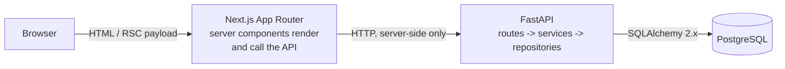
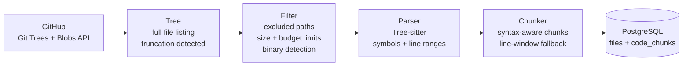

# DevPilot

DevPilot is a workspace for working on a codebase with an assistant that has actually read it. A
developer connects a GitHub repository; DevPilot indexes it, answers questions with the relevant
files in hand, proposes code changes as a reviewable diff, and — only after a human approves — opens
a pull request. The product's centre of gravity is the review step: nothing reaches a repository
without someone deciding that it should.

## What it does

The intended end-to-end flow is:

1. **Connect** a GitHub repository to a workspace.
2. **Index** it — walk the default branch, parse source files, and prepare them for retrieval.
3. **Ask** questions and get answers grounded in specific files and line ranges, with the retrieved
   sources shown alongside the answer.
4. **Review** proposed edits as a diff, file by file.
5. **Ship** approved changes as a commit on a new branch and a pull request.

## Current status

**Steps 1–3 of the flow above are implemented and working: connect, index, and browse the
structured result.** A repository can be signed into via GitHub, connected, and indexed into
PostgreSQL as source files and syntax-aware code chunks.

**This milestone prepares structured code for retrieval. It does not perform semantic or vector
search yet** — there are no embeddings, no vector index, and no model calls anywhere in the
codebase.

What works end to end:

- GitHub OAuth sign-in, with the access token encrypted at rest and never exposed to the browser.
- Connecting a repository, with visibility and default branch read from GitHub itself.
- Indexing: repository tree → filtering → source download → language detection → Tree-sitter
  parsing → structural chunking → PostgreSQL, with real counts reported in the UI.
- Re-indexing, which replaces the previous snapshot without producing duplicates.

What deliberately does not exist yet: embeddings, vector search, RAG, answer generation, proposed
changes, diffs, and pull requests. Those screens still render explicit empty states driven by real
backend state — nothing is simulated.

## Architecture



The browser never calls the API directly. Server components fetch through `src/lib/api.ts`, which
returns a discriminated `ApiResult` instead of throwing — so every page is forced to handle the
failure case, and the backend origin stays out of the client bundle.

Inside the backend a request flows in one direction only:

```
route (HTTP shape) -> service (rules) -> repository (SQL) -> session (transaction)
```

### Indexing architecture



Each stage is its own module under `app/services/indexing/`, and
`app/services/indexing/service.py` only sequences them and owns the transaction boundaries. The
route calls one function.

**Repository content is data, never code.** It is downloaded, decoded, parsed by Tree-sitter and
stored. Nothing from a repository is executed, imported, installed, built, or passed to a shell.

Routes never contain SQL. Data access lives in `app/repositories/` so the statements stay visible in
one place.

## Repository structure

```
DevPilot/
├── backend/
│   ├── app/
│   │   ├── main.py            application factory, middleware, lifespan
│   │   ├── api/               routers, route modules, shared dependencies
│   │   ├── core/              configuration, logging, error taxonomy
│   │   ├── db/                declarative base, engine, session lifecycle
│   │   ├── models/            SQLAlchemy models
│   │   ├── repositories/      data access — all SQL lives here
│   │   ├── schemas/           Pydantic request/response models
│   │   └── services/          rules that combine config and data access
│   ├── alembic/               migration environment and versions
│   └── tests/                 pytest suite
├── frontend/
│   └── src/
│       ├── app/               routes, layouts, error and loading boundaries
│       ├── components/        UI primitives, layout shell, feature components
│       └── lib/               API client, navigation model, theme store
├── docker-compose.yml         PostgreSQL for local development
└── .env.example
```

### Routes

| Frontend                                                  | Purpose                              |
| --------------------------------------------------------- | ------------------------------------ |
| `/`                                                        | Dashboard                            |
| `/repositories`, `/repositories/connect`                   | Repository list and connection state |
| `/repositories/[owner]/[repo]`                             | Workspace overview                   |
| `.../code`, `.../ask`, `.../changes`, `.../pull-requests`  | Workspace tabs                       |
| `/activity`, `/settings`                                   | Activity log and settings            |

| API                                              | Purpose                                       |
| ------------------------------------------------ | --------------------------------------------- |
| `GET /health`                                     | Liveness — touches no dependency              |
| `GET /health/ready`                               | Readiness — verifies the database answers     |
| `GET /api/v1/meta/integrations`                   | Which integrations are configured (booleans)  |
| `GET /api/v1/auth/github/authorize`               | Start GitHub sign-in                          |
| `POST /api/v1/auth/github/callback`               | Exchange the code, issue a session            |
| `GET /api/v1/auth/me`                             | The signed-in account, or `null`              |
| `POST /api/v1/auth/github/disconnect`             | Forget the stored GitHub token                |
| `GET /api/v1/repositories`                        | Repositories connected by the caller          |
| `POST /api/v1/repositories`                       | Connect a repository by `owner`/`name`        |
| `GET /api/v1/repositories/{owner}/{name}`         | One repository, or a structured 404           |
| `POST /api/v1/repositories/{id}/index`            | Run indexing — **synchronous**, returns stats |
| `GET /api/v1/repositories/{id}/index`             | Current indexing state                        |
| `GET /api/v1/repositories/{id}/languages`         | Indexed file counts per language              |

`POST /{id}/index` holds the request open for the whole run and returns the real counts. There is no
worker queue, and the status response says so explicitly (`"synchronous": true`) rather than
implying a background job that does not exist.

The API is stateless: Next.js holds the session in an HttpOnly cookie and forwards it as
`Authorization: Bearer`, so the backend never depends on cookie domains.

Every failure — from any route — has the same body:

```json
{ "error": { "code": "not_found", "message": "…", "details": { } } }
```

so the frontend branches on `code` rather than parsing prose. Unexpected exceptions are logged with
a traceback and reported generically; driver messages, which can embed the connection string, never
reach the client.

## Local development

Prerequisites: Node 20+, Python 3.11+, and PostgreSQL 16 (via Docker or installed natively).

> **Windows PowerShell users:** `&&` is not a statement separator in Windows PowerShell 5.1. Run
> each line below on its own — every command here is written one per line for that reason.

**0. Configuration**

```
cp .env.example .env
```

**1. Database** — either option works; they are alternatives, not steps.

*With Docker:*

```
docker compose up -d --wait
```

*Without Docker*, install PostgreSQL 16 and create the database. On Windows:

```
winget install PostgreSQL.PostgreSQL.16
```

Then, in a new shell so the updated PATH is picked up:

```
psql -U postgres -c "CREATE USER devpilot WITH PASSWORD 'devpilot';"
psql -U postgres -c "CREATE DATABASE devpilot OWNER devpilot;"
```

Any PostgreSQL 16 instance is fine as long as `DATABASE_URL` in `.env` points at it.

**2. Backend** — run from the `backend/` directory.

```
cd backend
python -m venv .venv
```

Activate the virtual environment:

```
.venv\Scripts\Activate.ps1     # Windows PowerShell
.venv\Scripts\activate.bat     # Windows cmd
source .venv/bin/activate      # macOS / Linux
```

If PowerShell blocks the activation script, skip activating and call the interpreter directly
(`.venv\Scripts\python.exe -m ...`), or allow scripts for the current user with
`Set-ExecutionPolicy -Scope CurrentUser RemoteSigned`.

```
pip install -e ".[dev]"
alembic upgrade head
uvicorn app.main:app --reload --port 8000
```

`uvicorn` must be started from `backend/`, otherwise `app` is not importable
(`ModuleNotFoundError: No module named 'app'`).

API docs at http://localhost:8000/docs (local environments only).

**3. Frontend**

```
cd frontend
npm install
npm run dev
```

http://localhost:3000

### Running without a database

`GET /health` and `GET /api/v1/meta/integrations` need no database, so the app starts and the shell
renders. Routes that read data return `503 service_unavailable` within ~6s rather than hanging, and
the UI shows an explicit "database is unavailable" state. This is a degraded mode for inspecting the
interface, not a supported way to run DevPilot.

**Checks**

```
# backend — from backend/
pytest
ruff check .
ruff format --check .
mypy app

# frontend — from frontend/
npm test
npm run lint
npm run typecheck
npm run build
```

## Environment variables

All configuration comes from the environment; `.env.example` documents every variable. Secrets are
read by the backend only — never sent to the browser, never logged. The API exposes *whether* an
integration is configured, never the credential.

| Variable                                            | Used by  | Notes                                                   |
| ---------------------------------------------------- | -------- | ------------------------------------------------------- |
| `DATABASE_URL`                                       | backend  | Keep the `+psycopg` suffix; psycopg 3 is the driver.    |
| `POSTGRES_USER` / `_PASSWORD` / `_DB` / `_PORT`      | compose  | Must match `DATABASE_URL`.                              |
| `DEVPILOT_ENV`                                       | backend  | `local` enables `/docs`; use `production` when deployed.|
| `LOG_LEVEL`, `CORS_ORIGINS`                          | backend  | `CORS_ORIGINS` is comma-separated.                      |
| `BACKEND_URL`                                        | frontend | Server-side only; the browser never sees it.            |
| `NEXT_PUBLIC_APP_URL`                                | frontend | Public origin, for absolute links and future callbacks. |
| `SECRET_KEY`                                         | backend  | Signs sessions and OAuth state; derives the token encryption key. Required outside local. |
| `GITHUB_CLIENT_ID` / `_SECRET`                       | backend  | From a GitHub OAuth App. Callback: `http://localhost:3000/api/auth/github/callback`. |
| `GITHUB_WEBHOOK_SECRET`                              | backend  | Reserved; unused in this milestone.                     |
| `GITHUB_API_URL` / `_TIMEOUT_SECONDS` / `_MAX_CONCURRENCY` | backend | API base, per-request timeout, blob download concurrency. |
| `INDEX_MAX_*`, `INDEX_FALLBACK_CHUNK_LINES`          | backend  | Indexing resource limits — see below.                   |
| `ANTHROPIC_API_KEY`                                  | backend  | Reserved for the retrieval and answering milestone.     |

## Indexing

### Supported languages

**Parsed with Tree-sitter** — structure is extracted, so chunks are functions, classes and methods:

| Language              | Extensions                  |
| --------------------- | --------------------------- |
| Python                | `.py`, `.pyi`               |
| JavaScript            | `.js`, `.mjs`, `.cjs`       |
| JavaScript (JSX)      | `.jsx`                      |
| TypeScript            | `.ts`, `.mts`, `.cts`       |
| TypeScript (TSX)      | `.tsx`                      |

**Stored as text, not parsed** — indexed and searchable, but chunked by line windows because no
grammar is configured: Java, C, C++, C#, Go, Rust, Ruby, PHP, SQL, Markdown, JSON, YAML, TOML,
Shell, HTML, CSS, plain text.

The registry in `app/services/indexing/languages.py` marks a language `parseable` only when
`parser.py` really has a grammar for it, and a test asserts the two agree. DevPilot never claims
syntax awareness it does not have. Adding a language means adding a grammar, node-type mappings and
tests — not just an extension.

### Filtering rules

Applied in `app/services/indexing/filters.py`, the single place any path or extension is inspected.

Excluded by directory segment: `.git`, `.hg`, `.svn`, `node_modules`, `bower_components`, `vendor`,
`.venv`, `venv`, `env`, `site-packages`, `__pycache__`, `.mypy_cache`, `.pytest_cache`,
`.ruff_cache`, `.tox`, `dist`, `build`, `out`, `target`, `obj`, `.next`, `.nuxt`, `.turbo`,
`.gradle`, `.terraform`, `coverage`, `htmlcov`, `.idea`, `.vscode`.

Matching is on whole segments, so a file named `build.py` is kept while `build/out.js` is not.

Also excluded: lockfiles (`package-lock.json`, `yarn.lock`, `pnpm-lock.yaml`, `poetry.lock`,
`Cargo.lock`, `composer.lock`, `Gemfile.lock`, `go.sum`), build products keeping a source extension
(`*.min.js`, `*.min.css`, `*.bundle.js`, `*.map`, `*.lock`), submodules, empty files, unknown
extensions, and files over the size limit.

Binary detection is a NUL byte in the first 8 000 bytes. Decoding is strict UTF-8 — a file that
will not decode is skipped rather than mangled, because replacing bad bytes would silently corrupt
the stored source and every chunk cut from it.

### Chunking strategy

**Emit the largest syntactic unit that fits inside the size limit, and descend into it only when it
does not.**

- A function or method that fits becomes one chunk.
- A class that fits is kept whole — its methods are *not* also emitted, because that would store the
  same code twice.
- A class too large to store whole yields its methods individually, plus the class's own leftover
  body as separate blocks. The parent is never duplicated into its children.
- A single symbol larger than the limit is split on line boundaries into numbered parts
  (`part_index` / `part_count`), each keeping the symbol's name and type.
- A file with no parseable structure falls back to line windows.

Every chunk carries `path → symbol → parent_symbol → line range → source`, so a future retrieval
result can be displayed without reparsing anything. Context is preserved by reference —
`parent_symbol` names the enclosing class rather than copying its body into each method.

Chunks never overlap, boundaries never cut mid-line, and fragments with no alphanumeric content
(a stray `;` or closing brace) are dropped rather than stored as noise.

Wrappers are folded into the declaration they introduce: `export class Widget` and a decorated
Python function are each one chunk, not a chunk plus an orphaned `export`/`@decorator` fragment.

### Resource limits

| Limit                        | Default | Why                                                             |
| ---------------------------- | ------- | --------------------------------------------------------------- |
| `INDEX_MAX_FILE_BYTES`       | 512 KB  | Comfortably holds real source; larger is usually generated data. |
| `INDEX_MAX_TOTAL_BYTES`      | 50 MB   | Ceiling on one repository's indexed source.                      |
| `INDEX_MAX_FILES`            | 5 000   | Bounds a run's request count and duration.                       |
| `INDEX_MAX_CHUNK_CHARS`      | 8 000   | Large enough for most functions; splits beyond it.               |
| `INDEX_FALLBACK_CHUNK_LINES` | 120     | Line window for unstructured files.                              |
| `GITHUB_MAX_CONCURRENCY`     | 8       | Concurrent blob downloads; far below any rate limit.             |
| `GITHUB_TIMEOUT_SECONDS`     | 20      | Per request, with retries on 5xx only.                           |
| Subtree requests             | 300     | Cap when walking a truncated tree.                               |

Blobs are downloaded in windows rather than all at once, so memory stays flat instead of growing
with the repository, and rows are flushed to the open transaction every 25 files.

### Indexing states

```
not_indexed ──▶ indexing ──▶ indexed
                    └──────▶ failed

indexed ──▶ indexing ──▶ indexed | failed
failed  ──▶ indexing ──▶ indexed | failed
```

`queued` does not exist: indexing is synchronous, so nothing ever sits in a queue, and an
unreachable state would be a lie in the schema.

**A failed run never destroys a good index.** The old rows are deleted inside the same transaction
that writes the replacement, so the delete only becomes durable if the whole run commits. `failed`
means "the newest attempt failed", not "there is no index" — and the UI says so, naming the files
and chunks still searchable.

A run whose process died is detected as stale after 30 minutes so the repository can be retried
rather than being stuck in `indexing` forever.

### Known limitations

- **Indexing is synchronous.** The HTTP request is held open for the whole run, so a large
  repository means a long request, and navigating away cancels it. There is no worker
  infrastructure, and the API does not pretend otherwise.
- **No incremental progress.** Counts appear when the run completes; the UI shows an honest pending
  state rather than a fabricated percentage.
- **No incremental re-indexing.** A re-index replaces the whole snapshot, even if one file changed.
  `indexed_commit_sha` is stored so a future milestone can diff instead.
- **Truncated trees have a ceiling.** Past 300 subtree requests the run fails loudly rather than
  indexing part of a repository.
- **A parse failure is recorded, not hidden.** The file is stored and chunked by lines, and the run
  reports `complete: false` so a partially-parsed index is visible rather than silent.

## Database schema

`users`, `repositories`, `files`, `code_chunks`, `conversations`, `messages`. Decisions worth
stating:

- **UUID primary keys, generated in the application.** A caller holds the id before the INSERT,
  which makes logging and building related rows in one flush straightforward.
- **`repositories` is unique on `(provider, owner, name)`.** That triple is also how the frontend
  addresses a repository (`/repositories/{owner}/{repo}`), so the URL and the constraint agree.
  Lookups are case-insensitive, because a pasted URL may not match the stored casing.
- **`files` is unique on `(repository_id, path)`.** Re-indexing replaces a repository's rows rather
  than appending, and the constraint makes a duplicate impossible rather than merely unlikely.
- **File content is stored inline.** Retrieval needs the exact bytes that were parsed, not whatever
  the branch holds later, and the per-file size limit keeps rows bounded.
- **`code_chunks.repository_id` is denormalised** from `files`. Retrieval always filters by
  repository, and this avoids a join on the hottest future query path.
- **`users.email` is nullable, `github_id` is the identity.** GitHub only releases an email for
  accounts with a public address, and a user can rename their login — the numeric id cannot change.
- **No `repository_memberships` table.** A single `connected_by_user_id` covers the current
  single-workspace model. Membership arrives with multi-user workspaces and is cheap to migrate to;
  adding it now would be a table with no reader.
- **Indexes follow actual reads.** `(file_id, start_line)` reads a file's chunks in source order;
  `(repository_id, chunk_type)` answers repository-wide filters; `(repository_id, language)` backs
  the language breakdown. Nothing is indexed speculatively.

Foreign keys cascade where the child is meaningless without its parent (messages → conversations,
conversations → repositories) and `SET NULL` where it is not — deleting a user should not delete the
repository they connected.

## Engineering decisions

**Next.js (App Router).** The screens are read-heavy and mostly rendered from API data. Server
components put the API call, the empty-state decision and the markup in one file with no client-side
data-fetching layer, and keep `BACKEND_URL` off the client entirely.

**FastAPI + Pydantic + SQLAlchemy 2.x.** The work ahead — parsing repositories, embedding code,
calling model APIs — is Python work. Pydantic gives one schema definition that is also the OpenAPI
contract. SQLAlchemy 2.x's `select()` keeps queries readable as SQL instead of hiding them; sessions
are synchronous and routes are declared `def`, so they run in FastAPI's threadpool and the query path
stays easy to reason about. Async is a change to make when a measurement asks for it.

**PostgreSQL.** Relational data with real foreign keys, plus `pgvector` when embeddings arrive —
which means retrieval will not require a second datastore.

**Docker Compose for the database only.** Stateful infrastructure is worth containerising; the app
processes are not, because `uvicorn --reload` and `next dev` are faster on the host.

**Tree-sitter for parsing.** Error-tolerant by design, so a file with one broken function still
yields the other ten instead of raising. It is also a pure function of bytes — no repository code is
executed to understand it, which a regex-based or import-based approach could not promise.
`app/services/indexing/parser.py` is the only module that imports it; the chunker works with a flat,
language-neutral `SymbolNode`, so adding a grammar never reaches the chunker.

**Synchronous indexing, and no queue.** A background worker would need a broker, a worker process,
job state, and a progress channel — infrastructure this milestone does not need to prove the
pipeline works. The cost is an open request, which the API and UI both state plainly. Adding a queue
later changes the transport, not the pipeline.

**Deliberately absent:** Redis, a queue, a vector database, embeddings, containers for the app
processes. Each solves a problem this codebase does not have yet.

## Design notes

Dark-first, with a working light theme. Tokens are defined twice over: a raw `--dp-*` palette that is
the only thing a theme changes, mapped onto Tailwind utilities in `@theme`, so switching themes never
requires touching a component. The type scale is one step denser than Tailwind's default (13px base)
because this is a tool, not a marketing page. Depth comes from hairline borders rather than shadow,
and colour is reserved for the accent, status, and nothing else.

Empty states are a first-class component, not an afterthought — they are the default state of most
screens in this milestone, so each one names what will fill the space and why it is empty.

## Roadmap

1. ~~**GitHub integration** — OAuth, token storage, repository connection.~~ **Done.**
2. ~~**Repository ingestion** — fetch the default branch, walk files, track sync state.~~ **Done.**
3. ~~**Code parsing** — language-aware splitting into functions, classes and modules.~~ **Done.**
4. **Embeddings** — embed the parsed units and persist vectors (`pgvector`). ← next
5. **Vector retrieval** — find the code that answers a question.
6. **RAG** — grounded answers with citations rendered in the context panel.
7. **Code-change generation** — turn an accepted answer into a concrete edit.
8. **Diff review** — file-by-file approval before anything is applied.
9. **GitHub PR creation** — commit approved changes to a branch and open a pull request.
