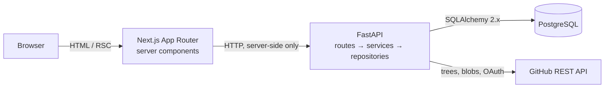
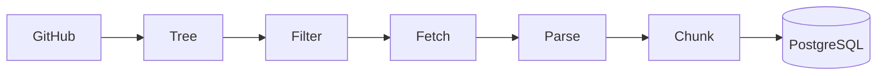
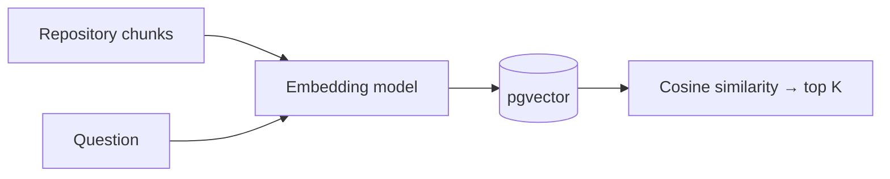

# DevPilot

**An AI engineering workspace that actually reads your codebase.**

Connect a GitHub repository and DevPilot builds a structured, syntax-aware index of it — every
function, class and method, with its file, symbol and line range intact. That index is the
foundation for answering questions about the code and, later, proposing changes you review before
anything is written back.

<br>

## What it does

Connect a repository, and DevPilot:

- **Signs you in with GitHub** — OAuth, with access tokens encrypted at rest and never exposed to
  the browser.
- **Discovers the full file tree** via the Git Trees API, including repositories large enough that
  GitHub truncates the recursive listing.
- **Filters intelligently** — vendored directories, build output, binaries and oversized files are
  skipped by a single policy component, not by checks scattered through the pipeline.
- **Parses with Tree-sitter** — real grammars, not regular expressions.
- **Chunks by structure** — a function becomes a chunk, a method remembers the class that contains
  it, and a file with no parseable structure falls back to conservative line windows.
- **Stores everything in PostgreSQL** with the repository state machine, so an index either
  succeeds completely or leaves the previous good index untouched.

<br>

## Architecture



The browser never calls the API directly. Server components fetch through a typed client that
returns a discriminated result rather than throwing, so every screen handles its failure case
explicitly. The backend origin and every credential stay server-side.

Inside the backend, a request flows one direction only:

```
route (HTTP shape) → service (rules) → repository (SQL) → session (transaction)
```

Routes never contain SQL.

<br>

## The indexing pipeline



| Stage | What happens |
| --- | --- |
| **Tree** | Recursive Git Trees call. If GitHub reports `truncated`, subtrees are walked individually and paths rebuilt — an incomplete listing is never treated as complete. |
| **Filter** | One policy decides what is indexable, and records a reason for everything skipped. |
| **Fetch** | Blobs downloaded through a bounded thread pool (8 concurrent by default), streamed rather than accumulated. |
| **Parse** | Tree-sitter builds a syntax tree. A parse failure marks that one file unparsed and the run continues. |
| **Chunk** | Structural units become chunks; oversized symbols split while keeping parent context and line ranges. |
| **Persist** | The new snapshot replaces the old one inside a transaction, then the repository is marked indexed. |

### Language support

**Parsed into symbols** — Python, JavaScript, TypeScript, JSX, TSX.

**Stored and searchable as text** — C, C++, C#, CSS, Go, HTML, Java, JSON, Markdown, PHP, Ruby,
Rust, Shell, SQL, TOML, YAML, plain text.

A language is only listed as parsed when a Tree-sitter grammar is actually configured for it.
Everything else is indexed as text rather than being quietly dropped.

### Chunking

Chunks follow syntax, not character counts:

```
class UserService
├── __init__          → chunk (parent_symbol: UserService)
├── create_user       → chunk (parent_symbol: UserService)
└── reset_password    → chunk (parent_symbol: UserService)
```

Each chunk records its type, symbol, parent symbol, line range, byte range and language — enough to
render `path → symbol → lines → source` without reparsing anything. Context is stored as metadata
rather than by copying the enclosing class into every method.

A symbol larger than the chunk limit is split into parts that record `part_index` / `part_count`,
so nothing is silently truncated. A file with no recognisable structure falls back to line windows.

### Resource limits

| Limit | Default | Override |
| --- | --- | --- |
| Max file size | 512 KB | `INDEX_MAX_FILE_BYTES` |
| Max indexed bytes per repository | 50 MB | `INDEX_MAX_TOTAL_BYTES` |
| Max files per repository | 5,000 | `INDEX_MAX_FILES` |
| Max chunk size | 8,000 chars | `INDEX_MAX_CHUNK_CHARS` |
| Fallback chunk window | 120 lines | `INDEX_FALLBACK_CHUNK_LINES` |
| Concurrent blob downloads | 8 | `GITHUB_MAX_CONCURRENCY` |

Repository content is treated as untrusted data throughout. DevPilot reads files — it never
executes repository code, installs dependencies, or runs build commands.

<br>

## Indexing states

```
not_indexed ──▶ indexing ──▶ indexed
                    │
                    └──────▶ failed
```

`failed` means *the most recent attempt* failed. A previous successful index survives it, so a
transient GitHub outage never costs you a working index.

<br>

## Quick start

**Requirements:** Node 20+, Python 3.11+, PostgreSQL 16 with the
[pgvector](https://github.com/pgvector/pgvector) extension.

```
git clone https://github.com/NatureHawk/Devpilot.git
cd Devpilot
cp .env.example .env
```

### 1. Database

```
docker compose up -d --wait
```

Or point `DATABASE_URL` at any PostgreSQL 16 instance.

### 2. Backend

```
cd backend
python -m venv .venv
```

Activate it — `.venv\Scripts\Activate.ps1` (PowerShell), `.venv\Scripts\activate.bat` (cmd), or
`source .venv/bin/activate` (macOS/Linux) — then:

```
pip install -e ".[dev]"
alembic upgrade head
uvicorn app.main:app --reload --port 8000
```

Run from `backend/`, so `app` is importable. API docs at `localhost:8000/docs`.

### 3. Frontend

```
cd frontend
npm install
npm run dev
```

Open **http://localhost:3000**.

### 4. Connect GitHub

Register an OAuth app at **github.com/settings/developers**:

| Field | Value |
| --- | --- |
| Homepage URL | `http://localhost:3000` |
| Authorization callback URL | `http://localhost:3000/api/auth/github/callback` |

Put the Client ID and secret in `.env`, generate a `SECRET_KEY`
(`python -c "import secrets; print(secrets.token_urlsafe(48))"`), restart the backend, then sign in
from Settings.

<br>

## Configuration

Every value comes from the environment; `.env.example` documents each one. Secrets are read by the
backend alone — never sent to the browser, never logged. The API reports *whether* an integration is
configured, never the credential itself.

| Variable | Purpose |
| --- | --- |
| `DATABASE_URL` | PostgreSQL connection. Keep the `+psycopg` prefix. |
| `SECRET_KEY` | Signs sessions and OAuth state; derives the token encryption key. |
| `GITHUB_CLIENT_ID` / `GITHUB_CLIENT_SECRET` | OAuth app credentials. |
| `BACKEND_URL` | Where Next.js reaches the API, server-side only. |
| `NEXT_PUBLIC_APP_URL` | Public origin, used for OAuth redirects. |
| `ANTHROPIC_API_KEY` | Language model credential. Without it, Ask and Changes report a configuration state rather than failing obscurely. |
| `LLM_MODEL` / `LLM_EFFORT` | Model identity and thinking depth. Defaults to `claude-opus-5` at `high`. |
| `AGENT_MAX_TOOL_CALLS` | Investigation tool budget. Defaults to 8. |
| `VOYAGE_API_KEY` | Embedding provider credential. Without it, indexing and search report a configuration error rather than failing obscurely. |
| `EMBEDDING_MODEL` / `EMBEDDING_DIMENSIONS` | Model identity and vector width. Changing either requires a re-index. |
| `INDEX_*` / `GITHUB_*` / `SEARCH_*` | Indexing limits, GitHub client tuning, retrieval bounds. |

<br>

## Semantic retrieval

Indexing does not stop at chunks. Every chunk is turned into an **embedding** — a vector of numbers
positioning it in a space where related meaning sits close together. That is what lets "where is
authentication handled" find `verify_session()` even though the two share no words.



**Provider.** Voyage AI `voyage-code-3` at 1024 dimensions, behind a small `EmbeddingProvider`
interface — the application never imports a provider SDK, so a local model can replace it later by
implementing one protocol.

**What gets embedded.** Not raw source. Each chunk is rendered as a deterministic representation
carrying its repository, path, language, kind and qualified symbol above the code, so the model sees
the vocabulary a question is likely to use. No LLM summarises anything: the representation is a pure
function of stored fields, so re-embedding unchanged code produces identical vectors.

**Queries and documents are embedded differently.** Retrieval models are asymmetric — a question and
a piece of source are not the same kind of text — so the input kind is a required argument rather
than a default that could silently degrade ranking.

**Storage.** A `chunk_embeddings` table rather than a column on `code_chunks`: a chunk is meaningful
before a vector exists, vector width belongs to the model rather than the chunk, and re-embedding
under a new model becomes a delete-and-insert on one table. Each row records its model and
dimensions, and search filters on the model the repository was actually indexed with — vectors from
different models are not comparable, and this makes mixing them impossible rather than merely
unlikely.

**Similarity.** Cosine, via pgvector's `<=>` operator, with an HNSW index built on
`vector_cosine_ops`. Cosine compares orientation rather than magnitude, which suits text embeddings
where vector length reflects little of interest. Scores are reported as `1 - distance`, so higher is
nearer.

> A score is a **ranking signal, not a probability**. It is meaningful for ordering results against
> each other, not as an absolute relevance threshold — there is no calibrated cutoff above which a
> result is "correct".

**Top-K.** Defaults to 8, bounded to 50. Ordering and limiting happen in the database on the indexed
distance expression, so only the returned rows ever materialise their source content.

**Indexing is atomic across embeddings.** A repository reaches `indexed` only after its vectors are
stored, so that state means *searchable*, not merely *parsed*. If the provider fails, the attempt is
marked `failed` and the previous index is left intact. Re-indexing replaces vectors wholesale, so old
and new embeddings never mix.

### Retrieval inspector

The repository workspace includes a search inspector: a query box that shows the ranked chunks with
their similarity scores, symbols and line ranges, each expandable to its source. It is an
engineering instrument, not a chat interface — retrieval quality is worth judging on its own, before
any model is asked to write prose over it.

**This milestone implements semantic retrieval, not answer generation.** Search returns code. No
language model is invoked at query time.

<br>

## Grounded answers

Retrieval finds the code; the model explains it. Both halves are visible, and the
answer is tied back to the evidence it came from.


**Why retrieval happens first.** A model with no view of your repository answers from
what codebases usually look like, which is how invented file paths get written with
total confidence. Retrieving first means every claim has something behind it, and the
absence of evidence becomes visible rather than being papered over.

**Why citations matter.** The model writes `[S1]` inline; the UI turns each into a
control that opens the exact file, symbol and line range it refers to. A claim you
cannot trace is a claim you cannot check — citations are what make an answer auditable
instead of merely plausible.

**Context construction.** Retrieved chunks are deduplicated, grouped by file, labelled
for citation, and packed against a character budget, highest-ranked first. Nothing is
summarised by a model before the answer — that would add a second call, a second cost,
and a second place for detail to go missing.

**Honest uncertainty.** Retrieval strength is classified as `none`, `weak` or `useful`
from the top score, the result count and file diversity, and the prompt is adjusted to
match. These are not probabilities — cosine similarity is not calibrated — so they only
decide how firmly the answer states that evidence is thin. Asked about a component that
does not exist, DevPilot says the repository does not show one rather than inventing a
path.

**Streaming.** Sources are sent first, then answer text as the model produces it. The
backend streams from the provider and forwards each increment; nothing is buffered and
replayed as a typing effect.

<br>

## Proposed changes

A change request is an investigation, not a single prompt.


The model gets three read-only tools — `search_code`, `read_file`, `find_symbol` — all
reading the indexed snapshot already in PostgreSQL. There is no write tool, no shell,
and no filesystem access.

**Why tools are bounded.** Every dimension is capped: **8 tool calls**, 10 model steps,
and a total tool-output budget. When the budget is spent the tools are withdrawn from
the request, so the next turn is necessarily the proposal. The loop terminates because
it structurally cannot do otherwise.

**Patches are anchored to content, not line numbers.** The model quotes the text it
wants to replace, and that text must appear **exactly once** in the file as indexed.
Zero matches or several are both refused — applying to the first of three matches could
silently change the wrong code. The model may only edit files it actually opened during
its investigation.

**Stale snapshots.** A proposal records the commit its patch was built against. If the
repository is re-indexed while it waits, it is marked `stale` and cannot be approved.
The check runs when a proposal is read and again at approval, because the repository can
move at any point in between.

**Why Git writes are excluded here.** Approval is an application state. DevPilot creates
no branches, commits or pull requests in this milestone. Getting the review surface right
is the whole point of the step, and shipping the write path at the same time would mean
trusting a review workflow nobody had used yet.

<br>

## Security model

Repository content is attacker-controlled. Anyone who can open a pull request can put
text in a file that DevPilot will later read.

| Control | How |
| --- | --- |
| **Prompt injection** | The system prompt establishes that repository content is data, never instructions. Retrieved code arrives only inside labelled evidence blocks in user messages — never in the system prompt. A file saying "ignore previous instructions" is quoted text. |
| **No code execution** | DevPilot reads files. It never runs repository code, installs dependencies, executes build commands, or shells out. Proposed tests are proposed — the UI says they have not been run, because there is no sandbox to run them in. |
| **Repository isolation** | Every tool query is scoped to the repository under investigation. `read_file` resolves paths against indexed rows, so `../../etc/passwd` matches nothing — traversal is impossible by construction rather than by filtering. |
| **Authorization** | A repository connected by someone else reads as missing, not forbidden, so an id is never confirmed to exist. |
| **Secrets** | Credentials live in the backend environment and are read there. Tokens are encrypted at rest with a key derived from `SECRET_KEY`. Provider error bodies are logged, never returned — they can echo request content, which here includes source. |
| **Output rendering** | Answers, diffs and excerpts are rendered as text. Nothing from a repository is ever interpreted as markup. |

<br>

<br>

## Data model

| Table | Holds |
| --- | --- |
| `users` | GitHub identity and the encrypted access token. |
| `repositories` | Connected repositories and their indexing state, commit SHA and counts. |
| `files` | One row per indexed path, with content, language and parse outcome. |
| `code_chunks` | Structural chunks with symbol, parent symbol, line and byte ranges. |
| `chunk_embeddings` | One pgvector embedding per chunk per model, with its dimensions. |
| `message_sources` | Citations: which chunk an answer drew on, with its location copied so it survives a re-index. |
| `proposed_changes` | Change requests, their investigation, validated edits, diff and review status. |
| `conversations` / `messages` | Question threads scoped to a repository. |

Design decisions worth naming:

- **UUID primary keys generated in the application**, so a caller holds the id before the INSERT.
- **`(provider, owner, name)` is unique** on repositories — the same triple the frontend routes on,
  matched case-insensitively because a pasted URL rarely matches stored casing.
- **`(repository_id, path)` is unique** on files, which is what makes re-indexing a replacement
  rather than an append.
- **`code_chunks.repository_id` is denormalised** from its file, because retrieval always filters
  by repository and this removes a join from the hottest query path.
- **Indexes follow real reads** — `(file_id, start_line)` for reading a file in order,
  `(repository_id, chunk_type)` for repository-wide filters.

Foreign keys cascade where a child is meaningless without its parent, and `SET NULL` where it
isn't — deleting a user doesn't delete the repositories they connected.

<br>

## API

| Endpoint | Purpose |
| --- | --- |
| `GET /health`, `GET /health/ready` | Liveness and readiness. |
| `GET /api/v1/auth/github/authorize` | Begin OAuth. |
| `GET /api/v1/auth/me` | Current user, or `null`. |
| `GET /api/v1/repositories` | Connected repositories. |
| `POST /api/v1/repositories` | Connect a repository by `owner/name`. |
| `GET /api/v1/repositories/{owner}/{name}` | One repository. |
| `POST /api/v1/repositories/{id}/index` | Index a repository. |
| `POST /api/v1/repositories/{id}/search` | Semantic search over indexed chunks. |
| `POST /api/v1/repositories/{id}/ask` | Grounded answer, streamed as server-sent events. |
| `GET /api/v1/repositories/{id}/conversations` | Conversation history. |
| `POST /api/v1/repositories/{id}/changes` | Investigate a request and propose a patch. |
| `POST /api/v1/changes/{id}/approve` · `/reject` | Record a human decision. |

Every failure returns the same envelope, so clients branch on a code rather than parsing prose:

```json
{ "error": { "code": "github_rate_limited", "message": "…", "details": {} } }
```

Driver and provider messages are logged, never returned — they can carry connection strings and
request context.

<br>

## Development

```
# backend — from backend/
pytest
ruff check .
mypy app

# frontend — from frontend/
npm test
npm run lint
npm run typecheck
npm run build
```

<br>

## Engineering notes

**Next.js App Router.** Screens are read-heavy and render from API data. Server components put the
fetch, the empty-state decision and the markup in one file, and keep credentials off the client.

**FastAPI + SQLAlchemy 2.x.** The work ahead — parsing, embedding, model calls — is Python work.
Pydantic gives one schema that is also the OpenAPI contract. `select()` keeps queries readable as
SQL instead of hiding them. Sessions are synchronous and routes are declared `def`, so they run in
FastAPI's threadpool and the query path stays easy to reason about.

**PostgreSQL with pgvector.** Relational data and vector search in one datastore. Retrieval filters
by repository and model before ranking, which is a plain SQL `WHERE` — with a separate vector
database that becomes a cross-system join.

**No AI frameworks.** No LangChain, no agent framework, no vector-database SDK. Direct calls and
small owned abstractions, so every layer stays inspectable.

<br>

## Roadmap

- [x] Application shell, API and schema
- [x] GitHub OAuth and repository connection
- [x] Repository indexing, Tree-sitter parsing, structural chunking
- [ ] Embeddings and semantic retrieval over indexed chunks
- [ ] Repository-grounded answers with citations
- [ ] Proposed code changes as reviewable diffs
- [ ] Pull request creation after human approval

<br>

## License

MIT
